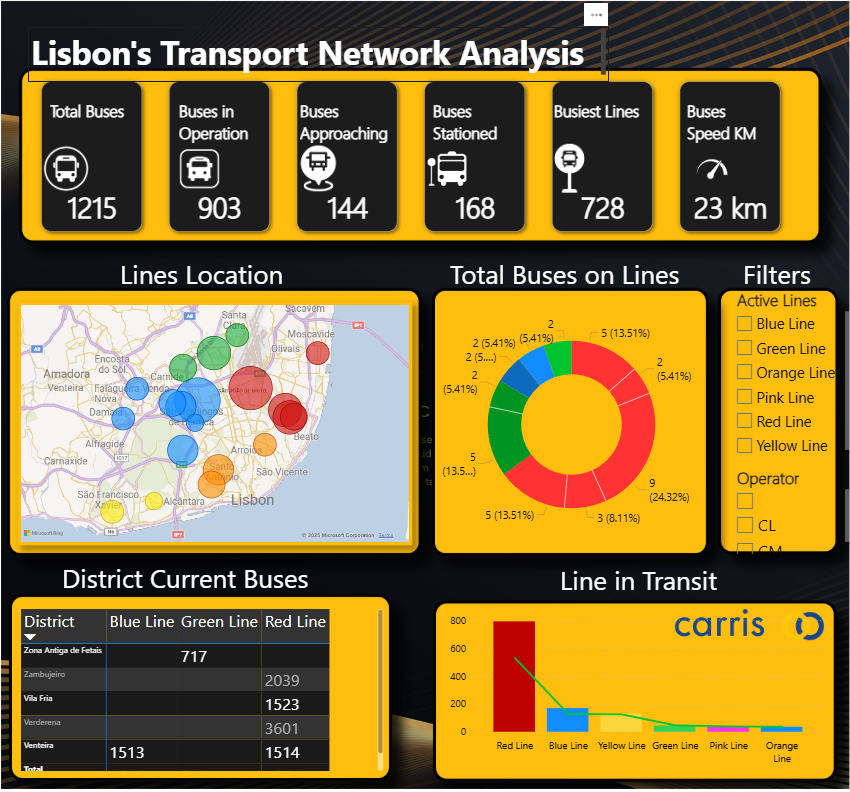

# 🚍 Lisbon’s Public Transport Network

A project for analyzing and visualizing Lisbon’s public transport data using Python, Jupyter Notebook, GTFS Realtime protocol, and Power BI.



---

## 📌 About the Project

This project aims to explore, analyze, and visualize the public transport system data of Lisbon, including:

- Bus data (Carris)
- Real-time data using GTFS Realtime protocol
- Power BI dashboards
- Data processing with Python

---

## 📡 API and Data Source

This project leverages the **GTFS Realtime API** provided by Lisbon’s public transport operators (e.g., Carris) to fetch live data about bus locations, routes, and schedules.

- The API delivers data in **GTFS Realtime protocol buffers format**, which allows efficient transmission of real-time transit information.
- Using the `gtfs_realtime_pb2.py` script, the project decodes this data and extracts relevant fields like vehicle positions, trip updates, and service alerts.
- The data is regularly fetched and processed in Python scripts (`ReatimeBus-1.py` and Jupyter notebook), enabling near real-time analysis.

---

## 🔄 Data Processing Workflow

1. **Data Acquisition**  
   - The Python script connects to the GTFS Realtime API endpoint and downloads raw protobuf data.

2. **Data Decoding & Cleaning**  
   - The protobuf data is decoded into readable dataframes using the `protobuf` Python package.
   - Data is cleaned, filtered, and merged with static datasets (like stop locations, schedules) stored in CSV files.

3. **Data Storage**  
   - Processed data is saved locally (e.g., CSV files, pickle caches) for efficient repeated access without hitting the API limit.

4. **Visualization**  
   - The cleaned data is visualized and analyzed inside the Jupyter Notebook.
   - Additionally, the data is imported into Power BI for building interactive dashboards.

---

## ⚙️ How to Update the Dashboard

To keep the Power BI dashboard up to date with the latest transport data, follow these steps:

1. **Run the Python scripts or Jupyter notebook** to fetch and process fresh data from the GTFS Realtime API.
   
2. **Export the processed datasets** (e.g., CSV files) into the folder used by Power BI (`Datasets/`).

3. **Open the Power BI desktop file (`Carris_System.pbix`)** and refresh the data source connections.

4. **Verify visual updates** on bus positions, route schedules, and other metrics.

5. **Publish the updated dashboard** to Power BI Service or share the `.pbix` file as needed.

---

### Optional automation idea (advanced)

- You can schedule the Python scripts to run periodically (using Windows Task Scheduler or cron jobs).
- Configure Power BI to auto-refresh data sources if hosted online for live dashboards.

---

## 🧰 Technologies Used

- **Python 3**
- **Jupyter Notebook**
- **Power BI**
- **Pandas, Requests, Protobuf**
- **GTFS Realtime Protocol**
- **Git & GitHub**

---

## 📂 Project Structure

```bash
📁 Lisbon’s Public Transport Network/
│
├── Datasets/                  # Organized CSV data files
├── Image/                     # Visual assets used in reports and README
├── ReatimeBus-1.py            # Main real-time data script
├── RealTime.ipynb             # Analysis notebook
├── Carris_System.pbix         # Power BI dashboard file
├── gtfs_realtime_pb2.py       # GTFS Realtime handler code
├── district_cache.pkl         # Cache of Lisbon districts
├── README.md                  # This file :)